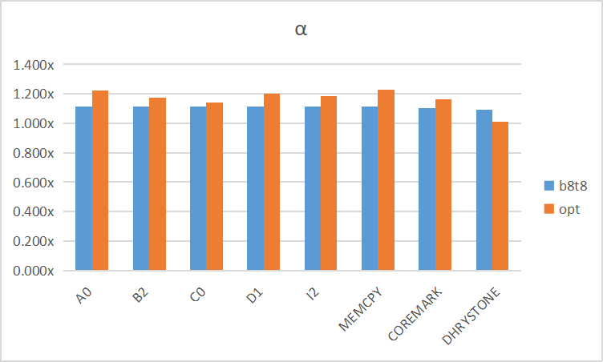

# Repository Structure

`IP/myCPU` contains all sources for 5-stage pipeline CPU, except IP sources

`perf` contains IPC result and timing report for each configuration in `*.txt`

## Branch

`btb32_tlb32_base` has the default sources with its corresponding result and report

e.g. `btb8_tlb8` configures the number of entries as 8 both for `btb` and `tlb`

if you want to make some changes, please checkout and push it with a new branch

easily checkout from the `main` branch with clean `IP/myCPU` and `perf`, then you can add your own

## Timing

| Conf.(BTB/TLB) | Frequency/MHz | WNS/ns | WHS/ns |   IPC    | α  |
| -------------: | :-----------: | :----: | :----: | :------: | ----- |
|          32/32 |      61       |  0.41  | 0.049  | 0.565166 | 1.000x |
|           32/4 |      66       | 0.272  | 0.052  | 0.565166 | 1.082x |
|           4/32 |      65       | 0.114  | 0.054  | 0.558985 | 1.054x |
|            4/4 |      66       | 0.238  | 0.055  | 0.558985 | 1.070x |
|            8/8 |      68       | 0.228  | 0.052  | 0.562701 | 1.110x |
|            opt |      75       | 0.105  | 0.049  | 0.534939 | 1.164x |
| opt2 | 80 | 0.141 | 0.053 |  |  |
| opt3 | 82 |  |  |  |  |

以默认配置（32/32）作为基准，加速比计算公式为：

$$α=\frac{T_{base}}{T}=\frac{\frac{I_{total}}{T}}{\frac{I_{total}}{T_{base}}}=\frac{\frac{I_{total}}{C/F}}{\frac{I_{total}}{C_{base}/F_{base}}}=\frac{IPC\times F}{IPC_{base}\times F_{base}}$$
## Performance

